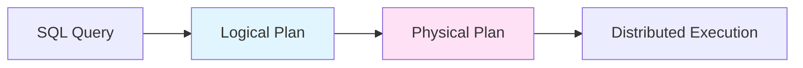

The Distributed SQL (DistSQL) execution framework allows CockroachDB to distribute the processing of SQL queries across multiple nodes, enabling horizontal scalability and bringing computation closer to data.

## Motivation

Distributing SQL processing provides several critical benefits:

<CardGroup cols={2}>
  <Card title="Remote-Side Filtering" icon="filter">
    Process filter expressions on nodes that hold the data, reducing network traffic and gateway load.
  </Card>
  
  <Card title="Remote-Side Updates" icon="pen-to-square">
    Execute UPDATE/DELETE operations directly on data nodes, avoiding round-trips through the gateway.
  </Card>
  
  <Card title="Parallel Computation" icon="arrows-split-up-and-left">
    Distribute JOINs, aggregations, and sorting across nodes to scale with data volume.
  </Card>
  
  <Card title="Reduced Latency" icon="gauge-high">
    Minimize data movement by processing close to storage, improving query response times.
  </Card>
</CardGroup>

## Architecture Overview

DistSQL separates query execution into two phases:



### Logical Plan

An abstract, non-distributed data flow representation:
- Independent of cluster topology
- Composed of **processors** (formerly "aggregators")
- Defines what computation happens, not where

### Physical Plan

A concrete mapping to cluster nodes:
- Maps logical processors to specific CockroachDB nodes
- Replicates and specializes processors based on topology
- Defines communication channels between nodes
- Scheduled and executed on the cluster

## Logical Planning

<Note>
Logical plans are made up of **processors** that consume input streams of rows and produce output streams, each with a defined schema.
</Note>

### Processor Characteristics

**Input/Output Streams**
- Typed row streams with defined schemas
- May consume multiple streams (e.g., for joins)
- Produce zero or one output stream

**Grouping**
- Defines which rows must be processed together
- Enables distribution: different groups → different nodes
- Group key: subset of columns that define groups
- No grouping = maximum parallelization potential

**Ordering**
- Some processors require ordered input
- Others guarantee ordered output
- Characterization function: `ord(input_order) → output_order`
- Sorting processors inserted when order mismatches occur

### Example: Aggregation Query

From `docs/RFCS/20160421_distributed_sql.md`:

```sql
TABLE Orders (OId INT PRIMARY KEY, CId INT, Value DECIMAL, Date DATE)

SELECT CID, SUM(VALUE) FROM Orders
  WHERE DATE > 2015
  GROUP BY CID
  ORDER BY 1 - SUM(Value)
```

**Logical Plan**:

```
TABLE-READER
  Table: Orders
  Output filter: (Date > 2015)
  Output schema: Cid:INT, Value:DECIMAL
  Grouping: none
    ↓
AGGREGATOR
  Group by: Cid
  Aggregations: SUM(Value)
  Output schema: Cid:INT, Sum:DECIMAL
  Grouping: Cid
    ↓
EVALUATOR
  Expression: 1 - Sum
  Output schema: Cid:INT, Sum:DECIMAL, Expr:DECIMAL
  Grouping: none
    ↓
SORT
  Order by: Expr DESC
  Grouping: none
    ↓
FINAL
  (Returns to client)
```

## Processor Types

### Data Sources

<Accordion title="TABLE READER">
Special processor with no input stream:
- Configured with table/index spans to read
- Outputs specified columns only
- Can apply filter expressions
- Provides ordering guarantees based on index

```go
// From pkg/sql/
type TableReader struct {
    spans []roachpb.Span
    outputFilter Expression
    columns []uint32
}
```
</Accordion>

### Computation Processors

<AccordionGroup>
  <Accordion title="AGGREGATOR">
    Performs SQL aggregation functions:
    - Groups rows by group key
    - Computes: SUM, COUNT, COUNT DISTINCT, AVG, MIN, MAX
    - Outputs one row per group
    - Optional filter on aggregated results
  </Accordion>
  
  <Accordion title="EVALUATOR">
    Programmable row transformation:
    - Processes one row at a time
    - No grouping (fully parallelizable)
    - Evaluates SQL expressions
    - Can filter or transform data
  </Accordion>
  
  <Accordion title="SORT">
    Sorts input stream:
    - No grouping (distributable to producers)
    - Provides intra-stream ordering
    - Global ordering via input synchronizer
    - Configurable sort columns and direction
  </Accordion>
</AccordionGroup>

### Join Processors

<AccordionGroup>
  <Accordion title="JOIN">
    Stream-based join:
    - Two input streams
    - Equality constraints on columns
    - Grouped on equality columns
    - Supports INNER, LEFT, RIGHT, FULL joins
  </Accordion>
  
  <Accordion title="JOIN READER">
    Index lookup join:
    - Point lookups for keys from input stream
    - Performs remote KV reads
    - Can set up remote flows
    - Efficient for index-based joins
  </Accordion>
</AccordionGroup>

### Control Processors

<Tip>
**LIMIT**: Single-group processor that stops after N rows.

**FINAL**: Single-group processor on gateway that collects results for the client.

**SET OPERATION**: Performs UNION, INTERSECT, EXCEPT on multiple input streams.
</Tip>

## Physical Planning

<Note>
Logical processors are transformed into physical **processors** distributed across nodes based on data locality and query requirements.
</Note>

### Processor Structure

Each physical processor has three components:

```
┌─────────────────────────────────┐
│      Input Synchronizer         │
│  (Merges multiple streams)      │
├─────────────────────────────────┤
│      Data Processor Core        │
│  (Transforms/aggregates data)   │
├─────────────────────────────────┤
│       Output Router             │
│  (Splits to multiple streams)   │
└─────────────────────────────────┘
```

### Input Synchronizer Types

**Single-input**: Pass-through for one stream

**Unsynchronized**: Arbitrarily interleaves multiple streams

**Ordered**: Merges streams while preserving ordering guarantees

From the design document:

> The input synchronizer is careful to interleave the streams so that the merged stream has the same ordering guarantee as individual input streams.

### Output Router Types

**Single-output**: Pass-through to one stream

**Mirror**: Every row sent to all output streams

**Hashing**: Rows distributed by hash function on specified columns
- Ensures rows with same hash go to same node
- Enables distributed GROUP BY and JOIN

**By Range**: Routes rows to nodes that are leaseholders for ranges
- Used for INSERT operations
- Used for JOIN READER processors

### Distribution Strategy

From `docs/RFCS/20160421_distributed_sql.md`:

<Steps>
  <Step title="Start with data layout">
    TABLE READER processors instantiated on range leaseholders for relevant spans
  </Step>
  
  <Step title="Colocate downstream processors">
    Processors consuming TABLE READER output often run on same nodes
  </Step>
  
  <Step title="Place grouped processors">
    Single-group processors (FINAL, LIMIT) run on gateway or single chosen node
  </Step>
  
  <Step title="Distribute multi-group processors">
    AGGREGATOR with grouping can run distributed with hash routing
  </Step>
</Steps>

## Execution Infrastructure

### Flows

A **flow** is a subgraph of the physical plan executed on a single node:

```go
// Conceptual structure from pkg/sql/
type Flow struct {
    processors []Processor
    inputMailboxes map[MailboxID]*Mailbox
    outputMailboxes map[MailboxID]*Mailbox
}
```

<Warning>
A single node may execute multiple heterogeneous flows for the same query, particularly when it's the leaseholder for multiple ranges of the same table.
</Warning>

### ScheduleFlows RPC

Gateway initiates distributed execution:

```
Gateway Node
    |
    +-- ScheduleFlows(Node1, Flow1)
    +-- ScheduleFlows(Node2, Flow2)
    +-- ScheduleFlows(Node3, Flow3)
```

Each `ScheduleFlows` call:
1. Sets up input/output mailboxes
2. Creates local processors
3. Starts processor execution as goroutines
4. Returns immediately (async execution)

### Mailboxes

<Note>
Mailboxes are named queues that allow producers and consumers to start at different times, buffering data until gRPC streams are established.
</Note>

**Mailbox Lifecycle**:


From the RFC:

> A gRPC stream is established by the consumer using the `StreamMailbox` RPC, taking a mailbox ID. From that moment on, gRPC flow control synchronizes producer and consumer.

### Local Scheduling

Processors scheduled concurrently within a node:
- Each processor runs as a goroutine
- Buffered channels connect processors
- Channel buffer size controls backpressure
- Natural Go concurrency model

## Example: Daily Promotion Query

Complex query demonstrating DistSQL capabilities:

```sql
TABLE Customers (
  CustomerID INT PRIMARY KEY,
  Email TEXT,
  Name TEXT
)

TABLE Orders (
  CustomerID INT,
  Date DATETIME,
  Value INT,
  PRIMARY KEY (CustomerID, Date),
  INDEX date (Date)
)

INSERT INTO DailyPromotion
(SELECT c.Email, c.Name, os.OrderCount FROM
      Customers AS c
    INNER JOIN
      (SELECT CustomerID, COUNT(*) as OrderCount FROM Orders
        WHERE Date >= '2015-01-01'
        GROUP BY CustomerID HAVING SUM(Value) >= 1000) AS os
    ON c.CustomerID = os.CustomerID)
```

**Physical Plan** involves:
- Multiple TABLE READERs distributed across range leaseholders
- Distributed AGGREGATORs with hash routing on CustomerID  
- JOIN processors colocated with data
- Final aggregation on gateway node

<Tip>
See `docs/RFCS/images/distributed_sql_daily_promotion_physical_plan.png` for the complete visualization.
</Tip>

## Performance Characteristics

### Benefits

**Reduced Network Traffic**
- Filtering happens before data crosses network
- Only relevant rows transferred between nodes
- Aggregations produce smaller result sets

**Improved Parallelism**
- Multiple nodes process query simultaneously
- Scales with cluster size
- CPU and I/O distributed across machines

**Lower Gateway Load**
- Gateway only handles coordination and final results
- Computation distributed to data nodes
- Better resource utilization

### Trade-offs

<Warning>
**Coordination Overhead**: More complex queries require more inter-node communication.

**Planning Complexity**: Physical planning must consider data distribution and network topology.

**Error Handling**: Distributed execution requires sophisticated error propagation and retry logic.
</Warning>

## Implementation Notes

Key source files:

- **Logical Planning**: `pkg/sql/opt/` (optimizer)
- **Physical Planning**: `pkg/sql/physicalplan/`
- **Processor Implementations**: `pkg/sql/rowexec/`
- **Flow Execution**: `pkg/sql/flowinfra/`
- **DistSQL Server**: `pkg/sql/distsql_running.go`

## Further Reading

<CardGroup cols={2}>
  <Card title="SQL Layer" icon="database" href="/architecture/sql-layer">
    SQL parsing and planning
  </Card>
  
  <Card title="Transaction Layer" icon="arrow-right-arrow-left" href="/architecture/transaction-layer">
    Distributed transactions
  </Card>
</CardGroup>