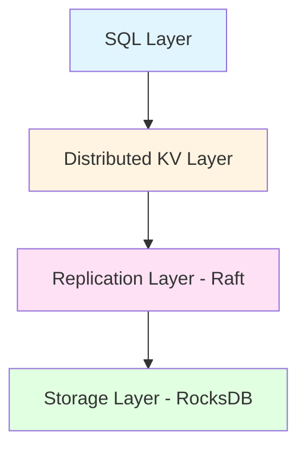

CockroachDB is a distributed SQL database built with **scalability**, **strong consistency**, and **survivability** as its primary design goals. The system aims to tolerate disk, machine, rack, and even datacenter failures with minimal latency disruption and no manual intervention.

## Design Principles

CockroachDB follows several key architectural principles:

<CardGroup cols={2}>
  <Card title="Homogeneous Deployment" icon="server">
    All nodes are symmetric with identical capabilities. Every node runs the same binary and can assume any role in the cluster.
  </Card>
  
  <Card title="Strong Consistency" icon="shield-check">
    Uses Raft consensus protocol for synchronous replication, providing ACID semantics and serializable isolation.
  </Card>
  
  <Card title="Horizontal Scalability" icon="arrow-right-arrow-left">
    Adding nodes increases capacity linearly. Queries can be sent to any node and distributed across the cluster.
  </Card>
  
  <Card title="Survivability" icon="heart">
    Tolerates failures at multiple levels through configurable replication (default 3x) across diverse geographic locations.
  </Card>
</CardGroup>

## Layered Architecture

CockroachDB implements a layered architecture where each layer builds upon the abstractions provided by the layer below:



### Layer Descriptions

**SQL Layer**
- Provides familiar relational concepts (schemas, tables, columns, indexes)
- Implements PostgreSQL wire protocol for client compatibility
- Handles query parsing, optimization, and distributed execution
- See [SQL Layer](/architecture/sql-layer) for details

**Distributed KV Layer**
- Presents abstraction of a single, monolithic sorted map from key to value
- Both keys and values are byte strings
- Handles range addressing and routing
- See [Distributed SQL](/architecture/distributed-sql) for details

**Replication Layer**
- Uses Raft consensus algorithm for strong consistency
- Manages range replicas and leader election
- Handles range splits, merges, and rebalancing
- See [Replication Layer](/architecture/replication-layer) for details

**Storage Layer**
- Built on RocksDB (a variant of LevelDB)
- Provides persistent storage with MVCC (Multi-Version Concurrency Control)
- Manages local disk I/O and compaction
- See [Storage Layer](/architecture/storage-layer) for details

## Data Distribution

<Note>
The KV map is logically divided into **ranges** - contiguous segments of the keyspace, each approximately 64MB by default.
</Note>

Each range is:
- **Replicated** to a configurable number of nodes (default: 3)
- **Self-contained** with its own Raft consensus group
- **Dynamic** - automatically split when too large or merged when too small
- **Balanced** - automatically rebalanced across nodes based on load

### Range Example

From the source code at `pkg/kv/`:n

```go
// Batch provides for the parallel execution of a number of database
// operations. Operations are added to the Batch and then the Batch is executed
// via either DB.Run, Txn.Run or Txn.Commit.
type Batch struct {
    // The Txn the batch is associated with
    txn *Txn
    // Results contains an entry for each operation added to the batch
    Results []Result
    // The Header which will be used to send the resulting BatchRequest
    Header kvpb.Header
    reqs   []kvpb.RequestUnion
}
```

## Node Architecture

<Accordion title="Node Components">
Each CockroachDB node consists of:

- **SQL Gateway**: Accepts client connections via PostgreSQL protocol
- **SQL Execution Engine**: Parses and executes SQL statements
- **Transaction Coordinator**: Manages distributed transactions
- **KV Client**: Sends KV operations to appropriate ranges
- **Stores**: One or more stores, each backed by a physical disk
- **Ranges**: Multiple range replicas per store
</Accordion>

### Symmetric Node Design

```
┌─────────────────────────────────────┐
│         CockroachDB Node            │
├─────────────────────────────────────┤
│  SQL Layer (PostgreSQL Protocol)    │
├─────────────────────────────────────┤
│  Distributed SQL Execution          │
├─────────────────────────────────────┤
│  Transaction Coordinator            │
├─────────────────────────────────────┤
│  KV Client / Range Router           │
├─────────────────────────────────────┤
│  Raft Groups (Range Replicas)       │
├─────────────────────────────────────┤
│  RocksDB Storage Engine             │
└─────────────────────────────────────┘
```

## Scalability Characteristics

CockroachDB achieves horizontal scalability through:

<Tip>
**Storage Capacity**: Adding more nodes increases cluster capacity by the storage per node divided by the replication factor. Theoretically supports up to 4 exabytes (4E) of logical data.
</Tip>

**Query Throughput**: 
- Client queries can be sent to any node
- Independent queries can execute without conflicts
- Overall throughput scales linearly with cluster size

**Distributed Queries**:
- Single queries are distributed across nodes
- Processing happens close to the data
- Parallelization improves performance for large operations

## Consistency Guarantees

<CardGroup cols={2}>
  <Card title="Snapshot Isolation (SI)" icon="camera">
    Lock-free reads and writes with possibility of write skew in rare cases. High performance option.
  </Card>
  
  <Card title="Serializable SI (SSI)" icon="lock">
    Default isolation level. Eliminates write skew through timestamp validation. No locking required.
  </Card>
</CardGroup>

From the design document:

> CockroachDB provides snapshot isolation (SI) and serializable snapshot isolation (SSI) semantics, allowing **externally consistent, lock-free reads and writes** - both from a historical snapshot timestamp and from the current wall clock time.

## Fault Tolerance

CockroachDB survives failures through:

**Replication Topology Options**:
- Same datacenter, different disks → disk failure tolerance
- Same datacenter, different racks → rack failure tolerance  
- Different datacenters, same region → datacenter failure tolerance
- Different regions → regional failure tolerance

<Warning>
With N replicas, the system tolerates F failures where **N = 2F + 1**.

Examples:
- 3 replicas → tolerates 1 failure
- 5 replicas → tolerates 2 failures
</Warning>

## Key Features

### Hybrid Logical Clock (HLC)

CockroachDB uses Hybrid Logical Clocks for timestamp management:
- Combines physical time (wall clock) and logical counters
- Tracks causality like vector clocks with less overhead
- Enables distributed transaction ordering without atomic clocks

### Zone Configurations

Similar to Google Spanner directories, zones allow configuration of:
- Replication factor per keyspace region
- Geographic placement constraints
- Storage device types (SSD vs. HDD)
- Performance and availability trade-offs

### Gossip Protocol

Nodes use an efficient gossip protocol to disseminate:
- Cluster topology information
- Node capacity and health metrics
- Range metadata and location
- Network connectivity status

## Entry Point: SQL Interface

<Note>
Every node in a CockroachDB cluster can act as a SQL gateway. The gateway transforms SQL statements into KV operations and distributes them across the cluster.
</Note>

SQL operations flow:
1. Client connects to any node via PostgreSQL protocol
2. SQL statement parsed and planned
3. Plan converted to distributed execution
4. KV operations sent to appropriate ranges
5. Results aggregated and returned to client

## Further Reading

<CardGroup cols={3}>
  <Card title="SQL Layer" icon="database" href="/architecture/sql-layer">
    Query parsing and execution
  </Card>
  
  <Card title="Distributed SQL" icon="diagram-project" href="/architecture/distributed-sql">
    Distributed query processing
  </Card>
  
  <Card title="Transaction Layer" icon="arrow-right-arrow-left" href="/architecture/transaction-layer">
    ACID transactions
  </Card>
  
  <Card title="Replication Layer" icon="copy" href="/architecture/replication-layer">
    Raft consensus
  </Card>
  
  <Card title="Storage Layer" icon="hard-drive" href="/architecture/storage-layer">
    RocksDB integration
  </Card>
</CardGroup>

## References

- Original design document: `docs/design.md`
- KV layer implementation: `pkg/kv/`
- SQL layer implementation: `pkg/sql/`
- Storage implementation: `pkg/storage/`