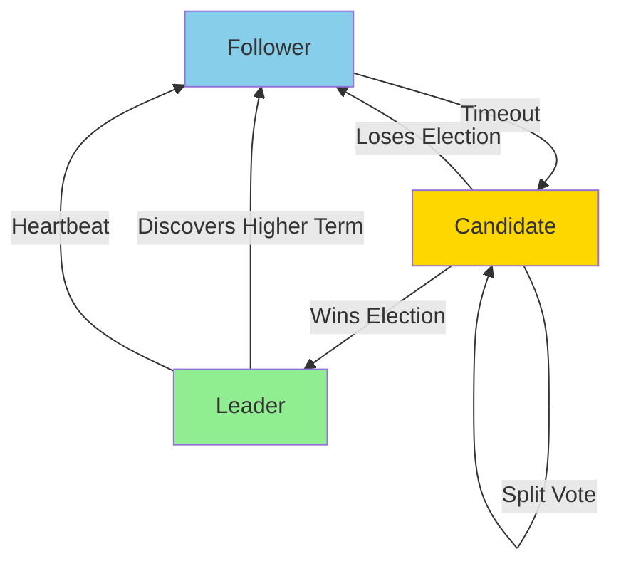
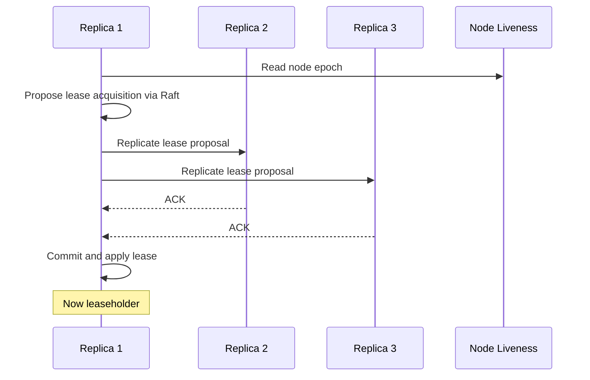

CockroachDB uses the **Raft consensus algorithm** to ensure that range replicas remain consistent and to provide fault tolerance. Each range maintains its own Raft group for coordinating writes and maintaining a replicated log.

## Why Raft?

CockroachDB chose Raft over alternatives like Paxos for several reasons:

<CardGroup cols={2}>
  <Card title="Understandability" icon="book">
    Raft is designed to be easier to understand than Paxos, with clear separation of leader election, log replication, and safety.
  </Card>
  
  <Card title="Reference Implementation" icon="code">
    Raft includes a reference implementation and covers important practical details often omitted from theoretical descriptions.
  </Card>
  
  <Card title="Strong Consistency" icon="shield-check">
    Guarantees that replicas maintain identical logs and provides ACID semantics for operations.
  </Card>
  
  <Card title="Production-Proven" icon="check">
    Successfully used in distributed systems like etcd, Consul, and CockroachDB itself.
  </Card>
</CardGroup>

<Note>
CockroachDB's Raft implementation was developed in collaboration with CoreOS (now part of Red Hat) and includes optimizations for managing millions of consensus groups.
</Note>

## Raft Basics

### Core Components

From `docs/design.md`:

> Raft elects a relatively long-lived leader which must be involved to propose commands. It heartbeats followers periodically and keeps their logs replicated. In the absence of heartbeats, followers become candidates after randomized election timeouts and proceed to hold new leader elections.



### Raft Roles

**Leader**
- Handles all client requests (reads and writes)
- Replicates log entries to followers
- Sends periodic heartbeats
- Only one leader per term

**Follower**
- Responds to leader requests
- Forwards client requests to leader
- Becomes candidate if heartbeats stop

**Candidate**
- Temporary state during election
- Requests votes from other replicas
- Either becomes leader or reverts to follower

## Range Replicas and Raft Groups

<Note>
Each range in CockroachDB is backed by its own Raft consensus group consisting of 3 or more replicas (configurable via zone config).
</Note>

### Range Replica Structure

```
Range [A-B)                Range [B-C)                Range [C-D)
┌──────────┐              ┌──────────┐              ┌──────────┐
│ Replica1 │◄─────────────│ Replica1 │◄─────────────│ Replica1 │
│ (Leader) │   Raft       │(Follower)│   Raft       │(Follower)│
├──────────┤              ├──────────┤              ├──────────┤
│ Replica2 │              │ Replica2 │              │ Replica2 │
│(Follower)│              │ (Leader) │              │(Follower)│
├──────────┤              ├──────────┤              ├──────────┤
│ Replica3 │              │ Replica3 │              │ Replica3 │
│(Follower)│              │(Follower)│              │ (Leader) │
└──────────┘              └──────────┘              └──────────┘
  Node 1                    Node 2                    Node 3
```

From the design document:

> The color coding shows associated range replicas. More than one replica for a range will never be placed on the same store or even the same node.

## Command Execution Flow

<Steps>
  <Step title="Client sends write request">
    Request routed to range's leaseholder (typically the Raft leader)
  </Step>
  
  <Step title="Leader proposes command">
    Leader appends command to local Raft log and proposes to followers
  </Step>
  
  <Step title="Followers replicate">
    Each follower appends command to its log and acknowledges
  </Step>
  
  <Step title="Commit when quorum reached">
    Once majority acknowledges, leader commits and applies command
  </Step>
  
  <Step title="Followers apply committed entries">
    Followers learn of commit and apply to their state machines
  </Step>
</Steps>

### Raft Log

Each replica maintains:

**Replicated Raft log** (stored in RocksDB):
- Sequence of proposed commands
- Each entry has: term number, index, command
- Guarantees all replicas have identical logs

**Raft state** (stored locally, unreplicated):
- Current term
- Voted for which candidate
- Commit index
- Last applied index

From `pkg/storage/` (key storage structures):

```go
// Replicated Range ID local keys store range metadata
// present on all replicas (updated via Raft)
// Examples: range lease state, abort span entries

// Unreplicated Range ID local keys store replica-local metadata
// Examples: Raft state, Raft log
```

## CockroachDB Raft Optimizations

<Warning>
A single CockroachDB node may manage **millions of Raft groups** (one per range replica). Standard Raft implementations don't scale to this level.
</Warning>

### Coalesced Heartbeats

<Accordion title="Problem">
With standard Raft, each range sends independent heartbeats. With millions of ranges, this creates enormous overhead.
</Accordion>

<Accordion title="Solution">
CockroachDB coalesces heartbeats so the number of heartbeat messages is proportional to the number of **nodes**, not the number of **ranges**.

```
Standard Raft:
Node A → Node B: 1M heartbeats (one per range)

CockroachDB Raft:
Node A → Node B: 1 batch containing all range heartbeats
```
</Accordion>

### Batch Processing

Raft operations are batched:
- Multiple proposals combined into single RPC
- Append entries sent in batches
- Reduces RPC overhead dramatically

### Optimized Election Timeouts

From the design document:

> Cockroach weights random timeouts such that the replicas with shorter round trip times to peers are more likely to hold elections first.

This ensures leaders are elected from well-connected replicas, improving performance.

### Future Optimizations

<Tip>
Planned improvements include:
- **Two-phase elections**: Reduce election traffic
- **Quiescent ranges**: Stop all traffic for inactive ranges
- **Leader stickiness**: Minimize leadership transfers
</Tip>

## Range Leases

While Raft ensures consistency, CockroachDB adds **range leases** for efficiency.

<Note>
A range lease is a time-bound exclusive right held by one replica, allowing it to serve reads and coordinate writes without going through Raft for every operation.
</Note>

### Why Leases?

**Without leases**:
- Every read requires Raft consensus (expensive)
- No single source of truth for current state
- Higher latency for common operations

**With leases**:
- Leaseholder serves reads locally (fast)
- Single replica coordinates range operations
- Other replicas redirect to leaseholder

### Lease Acquisition

From `docs/design.md`:

> A replica establishes itself as owning the lease on a range by committing a special lease acquisition log entry through Raft. The log entry contains the replica node's epoch from the node liveness table.



### Lease Properties

**Time-based validity**:
- Based on node liveness table
- Contains node epoch + expiration time
- Nodes heartbeat liveness table continuously

**Prevents split-brain**:
- Lease acquisition includes copy of current lease
- Only granted if current lease invalid or expired
- Relies on node epoch incrementing on failure

**Cooperative transfer**:
- Leases can be transferred between replicas
- Useful for load balancing
- Common during rebalancing

### Lease vs. Raft Leadership

<Warning>
Range leases are **completely separate** from Raft leadership, though CockroachDB tries to colocate them for efficiency.
</Warning>

**Why separate?**
- Raft leadership: consensus algorithm requirement
- Range lease: CockroachDB-specific optimization
- Different lifetime and transfer semantics

**Colocation benefits**:
- Leaseholder doesn't forward proposals to leader
- Reduces RPC round-trips
- Better performance

From the design document:

> In practice, that means the mismatch is rare and self-corrects quickly. Each lease renewal or transfer also attempts to colocate them.

## Read and Write Paths

### Write Path

```
Client Write Request
      |
      v
┌─────────────────┐
│  Leaseholder    │
│  (checks lease) │
└────────┬────────┘
         │
         v
┌─────────────────┐
│  Raft Leader    │
│ (proposes cmd)  │
└────────┬────────┘
         │
    ┌────┴────┐
    v         v
┌────────┐ ┌────────┐
│Follower│ │Follower│
│(append)│ │(append)│
└────────┘ └────────┘
    │         │
    └────┬────┘
         v
    Quorum Reached
         │
         v
   Commit & Apply
```

### Consistent Read Path

<Accordion title="Leaseholder Read (Fast Path)">
Leaseholder can serve reads locally:
- Verify lease still valid
- Check no overlapping pending writes
- Read from local RocksDB
- Return result (no Raft required)
</Accordion>

<Accordion title="Follower Read (Slow Path)">
Non-leaseholder replica:
- Detect it doesn't hold lease
- Return NotLeaseholderError with hint
- Client retries at actual leaseholder
</Accordion>

### Inconsistent Read Path

<Tip>
For stale reads or historical queries, any replica can serve the read without checking the lease, as long as the timestamp is in the past.
</Tip>

## Fault Tolerance

### Failure Scenarios

**Follower Failure** (F < N/2):
- Leader continues operating
- Quorum still achievable
- Failed follower catches up when recovered

**Leader Failure**:
- Followers detect missing heartbeats
- Election triggered after timeout
- New leader elected from followers
- Operations resume with new leader

**Majority Failure** (F ≥ N/2):
- Range becomes unavailable
- Cannot achieve quorum
- Requires manual intervention or recovery

### Self-Repair

From `docs/design.md`:

> If a store has not been heard from (gossiped their descriptors) in some time, the default setting being 5 minutes, the cluster will consider this store to be dead.

<Steps>
  <Step title="Detect dead node">
    Node fails to gossip for 5 minutes (default)
  </Step>
  
  <Step title="Mark replicas unavailable">
    All ranges with replicas on dead node identified
  </Step>
  
  <Step title="Up-replicate">
    Ranges create new replicas on available nodes
  </Step>
  
  <Step title="Restore replication factor">
    Once new replicas caught up, remove old replica
  </Step>
</Steps>

<Warning>
If ≥50% of replicas unavailable simultaneously, range unavailable until majority recovers.
</Warning>

## Splitting and Merging

### Range Splits

When a range exceeds size threshold (~64MB):

```
1. Leaseholder computes split key
2. Proposes split through Raft
3. All replicas apply split
4. Two new Raft groups formed
5. Metadata updated atomically
```

**Result**: 
- Range [A-C) becomes [A-B) and [B-C)
- Each new range has same replica set initially
- Ranges can then rebalance independently

### Range Merges

When a range falls below minimum threshold:

```
1. Choose adjacent range to merge with
2. Ensure replica sets compatible
3. Propose merge through Raft on both ranges
4. Combine data and logs
5. Single Raft group remains
```

## Rebalancing

CockroachDB automatically rebalances replicas based on:

<CardGroup cols={2}>
  <Card title="Replica Count" icon="hashtag">
    Number of replicas per store
  </Card>
  
  <Card title="Data Size" icon="database">
    Total bytes of data per store
  </Card>
  
  <Card title="Free Space" icon="hard-drive">
    Available disk space per store
  </Card>
  
  <Card title="Load" icon="gauge">
    CPU, network, and I/O load per store
  </Card>
</CardGroup>

Rebalancing follows the same algorithm as range splits/merges:
1. Add new replica to target node
2. Bring new replica up-to-date via Raft
3. Update range metadata
4. Remove old replica

## Implementation Details

Key source files:

**Raft Implementation**:
- `pkg/raft/`: Core Raft algorithm (from etcd/raft)
- `pkg/kv/kvserver/replica_raft.go`: Integration with CockroachDB

**Range Leases**:
- `pkg/kv/kvserver/replica_lease.go`
- `pkg/kv/kvserver/node_liveness.go`

**Replication**:
- `pkg/kv/kvserver/replica.go`
- `pkg/kv/kvserver/replica_proposal.go`

## Further Reading

<CardGroup cols={2}>
  <Card title="Transaction Layer" icon="arrow-right-arrow-left" href="/architecture/transaction-layer">
    How transactions work with Raft
  </Card>
  
  <Card title="Storage Layer" icon="hard-drive" href="/architecture/storage-layer">
    RocksDB and Raft log storage
  </Card>
</CardGroup>