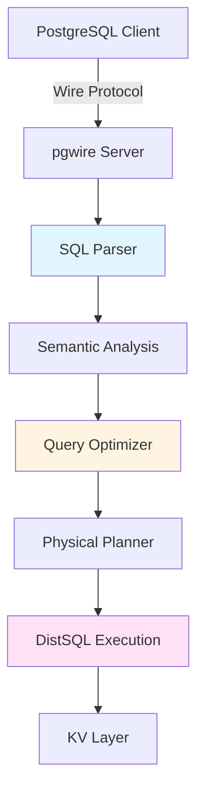
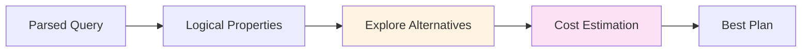

CockroachDB's SQL layer provides a familiar relational database interface with PostgreSQL wire protocol compatibility, translating SQL statements into distributed KV operations.

## Architecture Overview



<Note>
Every node in a CockroachDB cluster can act as a SQL gateway. Clients can connect to any node, and the gateway handles query distribution transparently.
</Note>

## PostgreSQL Compatibility

### Wire Protocol

CockroachDB implements the PostgreSQL wire protocol, allowing use of native PostgreSQL drivers:

```python
# Python example using psycopg2
import psycopg2

conn = psycopg2.connect(
    host="localhost",
    port=26257,
    user="root",
    database="mydb"
)
```

<CardGroup cols={3}>
  <Card title="Drivers" icon="plug">
    All PostgreSQL drivers work: psycopg2, pg, Npgsql, JDBC, etc.
  </Card>
  
  <Card title="Tools" icon="wrench">
    Compatible with pgAdmin, DBeaver, DataGrip, and other Postgres tools.
  </Card>
  
  <Card title="ORMs" icon="layer-group">
    Works with ActiveRecord, SQLAlchemy, Hibernate, Sequelize, etc.
  </Card>
</CardGroup>

### SQL Dialect

From `docs/design.md`:

> CockroachDB also attempts to emulate the flavor of SQL supported by PostgreSQL, although it also diverges in significant ways.

**Key differences**:

<AccordionGroup>
  <Accordion title="Isolation Levels">
    Only supports SNAPSHOT and SERIALIZABLE:
    
    ```sql
    -- READ UNCOMMITTED → mapped to SNAPSHOT
    -- READ COMMITTED → mapped to SNAPSHOT  
    -- REPEATABLE READ → mapped to SNAPSHOT
    -- SERIALIZABLE → true SERIALIZABLE
    
    SET TRANSACTION ISOLATION LEVEL SERIALIZABLE;
    ```
    
    From the design document:
    > CockroachDB exclusively implements MVCC-based consistency for transactions, and thus only supports SQL's isolation levels SNAPSHOT and SERIALIZABLE.
  </Accordion>
  
  <Accordion title="Type System">
    Simplified type coercion:
    
    - Limited implicit conversions
    - Rationale: simplicity and efficiency
    - Most generated SQL already has coherent typing
    - Existing SQL may need adjustments
    
    See `docs/RFCS/20160203_typing.md` for details.
  </Accordion>
  
  <Accordion title="Primary Keys">
    All tables must have a primary key:
    
    ```sql
    -- Explicit primary key
    CREATE TABLE users (
        id UUID PRIMARY KEY,
        name STRING
    );
    
    -- Implicit primary key added automatically
    CREATE TABLE logs (
        message STRING
    );
    -- CockroachDB adds hidden rowid column
    ```
  </Accordion>
</AccordionGroup>

## SQL Processing Pipeline

### 1. Connection Handling

From `docs/design.md`:

> Client connections over the network are handled in each node by a pgwire server process (goroutine). This handles the stream of incoming commands and sends back responses including query/statement results.

**Connection State**:

```go
// Simplified from pkg/sql/conn_executor.go
type connExecutor struct {
    sessionData *sessiondata.SessionData
    planner     *planner
    server      *Server
    metrics     *Metrics
}
```

**Session Management**:
- Session variables (e.g., `search_path`, `timezone`)
- Transaction state (BEGIN/COMMIT/ROLLBACK)
- Prepared statements
- Portal cursors

Implementation: `pkg/sql/conn_executor.go`

### 2. SQL Parsing

<Note>
CockroachDB uses a yacc-based parser that generates a syntax tree from SQL text.
</Note>

**Parser Generator**:
```bash
# From CLAUDE.md
./dev generate parsers  # Regenerate SQL parser
```

**Parse Tree Example**:

```sql
SELECT name, salary FROM employees WHERE dept = 'eng';
```

↓ Parses to:

```go
&tree.Select{
    Select: &tree.SelectClause{
        Exprs: [name, salary],
        From:  [employees],
        Where: &ComparisonExpr{dept = 'eng'},
    },
}
```

Implementation: `pkg/sql/parser/` and `pkg/sql/sem/tree/`

### 3. Semantic Analysis

**Name Resolution**:
- Resolve table and column names
- Check permissions
- Validate types
- Expand `*` in SELECT

**Type Checking**:
- Infer expression types
- Validate type compatibility
- Apply implicit conversions where allowed

**Constant Folding**:
```sql
SELECT 1 + 2 * 3 FROM t;
-- Simplified to:
SELECT 7 FROM t;
```

Implementation: `pkg/sql/sem/tree/` and `pkg/sql/opt/optbuilder/`

### 4. Query Optimization

CockroachDB uses a **cost-based optimizer** (CBO):



<Accordion title="Optimizer Architecture">
Based on the Cascade/Columbia optimizer framework:

1. **Memo Structure**: Compact representation of equivalent plans
2. **Exploration**: Generate logically equivalent alternatives
3. **Implementation**: Choose physical operators
4. **Costing**: Estimate CPU, I/O, network costs
5. **Pruning**: Eliminate dominated plans

Implementation: `pkg/sql/opt/`
</Accordion>

**Optimization Rules**:

<AccordionGroup>
  <Accordion title="Predicate Pushdown">
    Move filters close to data source:
    
    ```sql
    -- Original
    SELECT * FROM (
        SELECT * FROM users
    ) WHERE age > 18;
    
    -- Optimized  
    SELECT * FROM users WHERE age > 18;
    ```
  </Accordion>
  
  <Accordion title="Index Selection">
    Choose best index for query:
    
    ```sql
    CREATE INDEX idx_dept ON employees(dept);
    CREATE INDEX idx_salary ON employees(salary);
    
    -- Query: 
    SELECT * FROM employees WHERE dept = 'eng' AND salary > 100000;
    
    -- Optimizer chooses idx_dept (more selective)
    ```
  </Accordion>
  
  <Accordion title="Join Ordering">
    Reorder joins for efficiency:
    
    ```sql
    -- Original
    SELECT * FROM large_table
      JOIN small_table ON ...
      JOIN tiny_table ON ...;
    
    -- Optimizer may reorder to:
    -- tiny ⋈ small ⋈ large
    ```
  </Accordion>
  
  <Accordion title="Join Algorithm">
    Choose join implementation:
    
    - **Lookup Join**: Index-based point lookups
    - **Merge Join**: Sorted inputs, linear scan
    - **Hash Join**: Build hash table, probe
    - **Inverted Join**: For JSON, arrays, geospatial
  </Accordion>
</AccordionGroup>

**Statistics**:

<Tip>
The optimizer uses table statistics for cost estimation:

```sql
-- Collect statistics
CREATE STATISTICS stats_name FROM table_name;

-- View statistics
SHOW STATISTICS FOR TABLE table_name;
```

Statistics include:
- Row count
- Distinct value count
- Null count  
- Histograms for selectivity estimation
</Tip>

### 5. Physical Planning

Translates logical plan into physical execution plan:

**Operators**:
- **Scan**: Read from table/index
- **Filter**: Apply predicates
- **Project**: Compute expressions
- **Join**: Combine tables
- **Aggregate**: GROUP BY operations
- **Sort**: ORDER BY
- **Limit**: Row count restriction

**Distribution**:
- Determine which operations run where
- Insert streaming/routing operators
- Balance parallelism vs. overhead

See [Distributed SQL](/architecture/distributed-sql) for details.

Implementation: `pkg/sql/physicalplan/`

### 6. Execution

**Execution Engines**:

CockroachDB has multiple execution engines:

<Accordion title="Vectorized Engine (Default)">
Columnar execution for better performance:

```go
// Process batches of rows (typically 1024)
type Batch struct {
    Columns []Vector  // Column-oriented storage
    Length  int       // Rows in batch
}
```

Benefits:
- Better CPU cache utilization
- SIMD vectorization opportunities
- Reduced per-row overhead

Implementation: `pkg/sql/colexec/`
</Accordion>

<Accordion title="Row-at-a-Time Engine">
Traditional Volcano-style execution:

```go
type PlanNode interface {
    Next() (Row, error)
}
```

Used for:
- DDL statements
- Some specialized operations
- Fallback for unsupported operations

Implementation: `pkg/sql/rowexec/`
</Accordion>

## Data Mapping: SQL to KV

From `docs/design.md`:

### Table Encoding

<Note>
CockroachDB encodes SQL tables into KV pairs using a structured key format based on table ID, primary key, and column family.
</Note>

**Schema Metadata**:

```
Database: mydb (ID: 51)
Table: customers (ID: 42)
Columns:
  - name (ID: 69)
  - url (ID: 66)
```

Stored as:
```
/system/databases/mydb/id → 51
/system/tables/customers/id → 42  
/system/desc/51/42/name → 69
/system/desc/51/42/url → 66
```

**Row Data**:

For row with primary key "Apple":

```
Key Structure: /TableID/PrimaryKey/ColumnID

/51/42/Apple/69 → "1 Infinite Loop, Cupertino, CA"
/51/42/Apple/66 → "http://apple.com/"
```

<Tip>
**Prefix Compression**: RocksDB's prefix compression makes this efficient despite repetitive prefixes.
</Tip>

### Index Encoding

Secondary indexes:

```sql
CREATE INDEX idx_dept ON employees(dept);
```

Index entries:
```
/TableID/IndexID/IndexedColumns/PrimaryKey → []

/42/2/eng/emp001 → []
/42/2/eng/emp007 → []
/42/2/sales/emp003 → []
```

**Non-unique indexes**: Include primary key for uniqueness

**Unique indexes**: Indexed columns form the key

**Covering indexes**: Store additional columns in value

### Column Families

<Accordion title="Motivation">
Group frequently-accessed columns:

```sql
CREATE TABLE users (
    id INT PRIMARY KEY,
    email STRING,
    name STRING,
    profile_data JSONB,
    FAMILY f1 (id, email, name),
    FAMILY f2 (profile_data)
);
```

Benefits:
- Reduce I/O for narrow queries
- Better cache utilization  
- Smaller KV operations
</Accordion>

From the design document:

> Each remaining column or *column family* in the table is then encoded as a value in the underlying KV store, and the column/family identifier is appended as *suffix* to the KV key.

## Prepared Statements

**Preparation**:

```sql
PREPARE get_user AS 
  SELECT * FROM users WHERE id = $1;
```

**Execution**:

```sql
EXECUTE get_user(123);
EXECUTE get_user(456);
```

**Benefits**:
- Parse once, execute many times
- Plan caching (with some limitations)
- Prevent SQL injection

Implementation: `pkg/sql/conn_executor_prepare.go`

## Schema Changes

CockroachDB supports **online schema changes** without blocking:

<Steps>
  <Step title="Schema change initiated">
    ```sql
    ALTER TABLE users ADD COLUMN age INT;
    ```
  </Step>
  
  <Step title="Lease-based synchronization">
    Nodes acquire table descriptor leases with version numbers
  </Step>
  
  <Step title="Multi-version support">
    Multiple schema versions coexist during transition
  </Step>
  
  <Step title="Background backfill">
    New indexes/columns populated asynchronously
  </Step>
  
  <Step title="Cutover">
    Atomic switch to new schema once ready
  </Step>
</Steps>

See `docs/RFCS/20151014_online_schema_change.md` for details.

<Warning>
Some schema changes require multiple versions:

- Adding index: (none) → (write-only) → (backfilling) → (public)
- Dropping column: (public) → (write-only) → (delete-only) → (absent)

This prevents inconsistencies during distributed execution.
</Warning>

## Query Examples

### Simple Query

```sql
SELECT name, email FROM users WHERE dept = 'eng';
```

**Execution Path**:

1. **Parse**: `SELECT` statement → syntax tree
2. **Analyze**: Resolve `users` table, validate columns
3. **Optimize**: Choose index on `dept` if available
4. **Plan**: Scan → Filter → Project
5. **Execute**: 
   - TableReader on range leaseholders
   - Filter `dept = 'eng'` remotely
   - Return `name`, `email` to gateway
6. **Result**: Stream rows to client

### Join Query

```sql
SELECT u.name, o.total
FROM users u
JOIN orders o ON u.id = o.user_id
WHERE u.dept = 'sales';
```

**Possible Plans**:

<Accordion title="Lookup Join">
```
1. Scan users with dept = 'sales' filter
2. For each user.id:
   - Lookup orders by index on user_id
   - Join matching rows
3. Project name, total
```

Good when: Users table small after filtering
</Accordion>

<Accordion title="Hash Join">
```
1. Scan users (filter dept = 'sales')
2. Scan orders
3. Hash users by id
4. Probe hash table with orders.user_id
5. Project name, total
```

Good when: Both tables large, no suitable indexes
</Accordion>

<Accordion title="Merge Join">
```
1. Scan users (ordered by id, filter dept)
2. Scan orders (ordered by user_id)
3. Merge streams on id = user_id
4. Project name, total
```

Good when: Both inputs already sorted
</Accordion>

### Aggregation Query

```sql
SELECT dept, COUNT(*), AVG(salary)
FROM employees
GROUP BY dept
HAVING AVG(salary) > 100000;
```

**Distributed Execution**:

```
Node 1, 2, 3: (Partial aggregation)
├─ Scan local employees ranges
├─ Partial GROUP BY dept
├─ Compute: count_partial, sum, count (for avg)
└─ Stream to coordinator

Coordinator: (Final aggregation)  
├─ Receive partial results
├─ Final GROUP BY dept
├─ Compute: COUNT(*) = sum(count_partial)
│           AVG(salary) = sum(sum) / sum(count)
├─ Filter HAVING AVG(salary) > 100000
└─ Return to client
```

See [Distributed SQL](/architecture/distributed-sql) for details.

## Performance Features

### Query Hints

<Tip>
Force specific query behavior:

```sql
-- Force index
SELECT * FROM users@idx_dept WHERE dept = 'eng';

-- Force lookup join
SELECT /*+ LOOKUP JOIN */ * FROM users u JOIN orders o ...

-- Adjust join order
SELECT /*+ STRAIGHT JOIN */ * FROM a, b, c WHERE ...;
```
</Tip>

### Statement Bundle

Capture query diagnostics:

```sql
EXPLAIN ANALYZE (DEBUG) SELECT ...;
```

Generates bundle with:
- Query plan
- Statistics
- Trace data
- Environment info

### Query Profiling

```sql
SET tracing = on;
SELECT ...;
SET tracing = off;

SELECT * FROM crdb_internal.session_trace;
```

## Key Implementation Files

**Connection & Execution**:
- `pkg/sql/conn_executor.go` - Main SQL execution loop
- `pkg/sql/exec_util.go` - Execution utilities

**Parsing**:
- `pkg/sql/parser/` - SQL parser
- `pkg/sql/sem/tree/` - Syntax tree definitions

**Optimization**:
- `pkg/sql/opt/` - Cost-based optimizer
- `pkg/sql/opt/memo/` - Memo structure
- `pkg/sql/opt/xform/` - Optimization rules

**Execution**:
- `pkg/sql/colexec/` - Vectorized execution
- `pkg/sql/rowexec/` - Row-at-a-time execution
- `pkg/sql/distsql/` - Distributed SQL infrastructure

## Further Reading

<CardGroup cols={2}>
  <Card title="Distributed SQL" icon="diagram-project" href="/architecture/distributed-sql">
    Query distribution and parallelization
  </Card>
  
  <Card title="Transaction Layer" icon="arrow-right-arrow-left" href="/architecture/transaction-layer">
    SQL transaction semantics
  </Card>
</CardGroup>