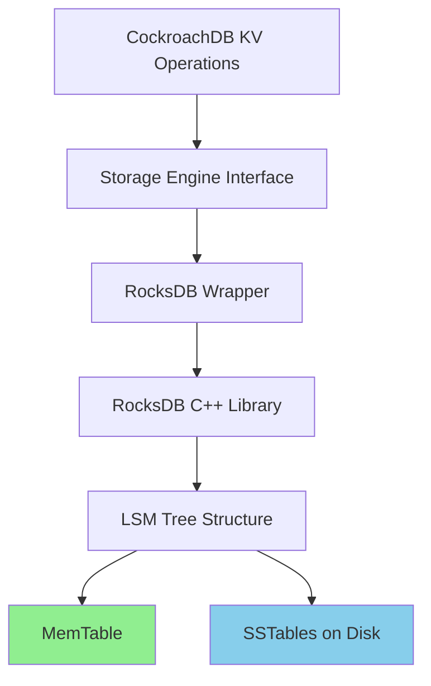

CockroachDB's storage layer is built on **RocksDB**, a high-performance embedded key-value store based on LevelDB. This layer provides persistent storage with multi-version concurrency control (MVCC) and efficient compaction.

## Why RocksDB?

CockroachDB chose RocksDB for several compelling reasons:

<CardGroup cols={2}>
  <Card title="Performance" icon="gauge-high">
    Optimized for high write throughput and low read latency on SSDs.
  </Card>
  
  <Card title="LSM-Tree Architecture" icon="tree">
    Log-Structured Merge Tree design provides efficient writes and background compaction.
  </Card>
  
  <Card title="Production-Proven" icon="check">
    Used by Facebook, LinkedIn, and many other large-scale systems.
  </Card>
  
  <Card title="Rich Feature Set" icon="toolbox">
    Supports prefix iteration, column families, snapshots, and custom comparators.
  </Card>
</CardGroup>

<Note>
RocksDB is a variant of Google's LevelDB with improvements for multi-threaded workloads and better configurability.
</Note>

## Architecture Overview



## Store Organization

### Node to Store Mapping

From `docs/design.md`:

> Nodes contain one or more stores. Each store should be placed on a unique disk. Internally, each store contains a single instance of RocksDB with a block cache shared amongst all of the stores in a node.

```
CockroachDB Node
├── Store 1 (SSD /dev/sda)
│   ├── RocksDB instance
│   ├── Range Replica 1
│   ├── Range Replica 5
│   └── Range Replica 9
├── Store 2 (SSD /dev/sdb)
│   ├── RocksDB instance
│   ├── Range Replica 2
│   ├── Range Replica 6
│   └── Range Replica 10
└── Store 3 (HDD /dev/sdc)
    ├── RocksDB instance
    ├── Range Replica 3
    ├── Range Replica 7
    └── Range Replica 11
```

<Tip>
Multiple stores per node allow better utilization of multiple disks and provide isolation between different storage tiers (SSD vs. HDD).
</Tip>

### Range Replicas in Stores

<Warning>
More than one replica for a range will **never** be placed on the same store or even the same node.
</Warning>

Each store:
- Contains multiple range replicas
- Shares a single RocksDB instance across all ranges
- Uses key prefixes to distinguish range data
- Maintains store-local metadata (unreplicated)

## Storage Engine Interface

CockroachDB abstracts storage through the `Engine` interface defined in `pkg/storage/engine.go`:

```go
// Simplified from pkg/storage/engine.go
type Engine interface {
    // Core operations
    Get(key MVCCKey) ([]byte, error)
    Put(key MVCCKey, value []byte) error
    Delete(key MVCCKey) error
    
    // Iteration
    NewIterator(opts IterOptions) Iterator
    
    // Batch operations
    NewBatch() Batch
    ApplyBatchRepr(repr []byte) error
    
    // Snapshots
    NewSnapshot() Reader
    
    // Maintenance
    Flush() error
    Compact() error
}
```

<Accordion title="Why an abstraction layer?">
- **Testing**: Can swap in in-memory implementations for tests
- **Flexibility**: Easier to experiment with different storage engines
- **Portability**: Storage-specific logic contained in wrapper layer
- **Feature additions**: Can add MVCC, encryption, etc. transparently
</Accordion>

## Multi-Version Concurrency Control (MVCC)

<Note>
CockroachDB implements MVCC by storing multiple timestamped versions of each key, allowing lock-free reads of historical data.
</Note>

### MVCC Keys

From `pkg/storage/engine_key.go`:

```go
// MVCCKey is a versioned key
type MVCCKey struct {
    Key       roachpb.Key  // Logical key
    Timestamp hlc.Timestamp // Version timestamp
}
```

**Physical encoding**:
```
[Key][Timestamp Suffix]
```

- Key: User-specified key bytes
- Timestamp: Hybrid Logical Clock timestamp (wall time + logical)
- Timestamp encoded in **descending** order for efficient iteration

### Versioned Values

From the design document:

> Cockroach maintains historical versions of values by storing them with associated commit timestamps. Reads and scans can specify a snapshot time to return the most recent writes prior to the snapshot timestamp.

**Example**:

```
Key: /users/1/name

[/users/1/name @ t=100] -> "Alice"
[/users/1/name @ t=200] -> "Alice Smith"
[/users/1/name @ t=300] -> "Alicia Smith"
```

Read at t=150 returns "Alice"
Read at t=250 returns "Alice Smith"  
Read at t=350 returns "Alicia Smith"

### MVCC Operations

<AccordionGroup>
  <Accordion title="MVCCGet">
    Read the value of a key at a specific timestamp:
    
    ```go
    func MVCCGet(
        engine Reader,
        key roachpb.Key,
        timestamp hlc.Timestamp,
    ) (value roachpb.Value, err error)
    ```
    
    Seeks to `MVCCKey{key, timestamp}` and reads first version ≤ timestamp.
  </Accordion>
  
  <Accordion title="MVCCPut">
    Write a new version of a key:
    
    ```go
    func MVCCPut(
        engine ReadWriter,
        key roachpb.Key,
        timestamp hlc.Timestamp,
        value roachpb.Value,
    ) error
    ```
    
    Writes `MVCCKey{key, timestamp} -> value`. Does not delete old versions.
  </Accordion>
  
  <Accordion title="MVCCDelete">
    Delete a key by writing a tombstone:
    
    ```go
    func MVCCDelete(
        engine ReadWriter,
        key roachpb.Key,
        timestamp hlc.Timestamp,
    ) error
    ```
    
    Writes an empty value at the timestamp. Old versions remain for historical reads.
  </Accordion>
</AccordionGroup>

### Garbage Collection

From the design document:

> Older versions of values are garbage collected by the system during compaction according to a user-specified expiration interval. In order to support long-running scans (e.g. for MapReduce), all versions have a minimum expiration.

<Steps>
  <Step title="Identify old versions">
    GC process scans for versions older than GC threshold
  </Step>
  
  <Step title="Respect minimum TTL">
    Honors minimum version retention for long-running scans
  </Step>
  
  <Step title="Delete during compaction">
    RocksDB compaction filter removes old versions
  </Step>
  
  <Step title="Update intent resolution">
    Ensures no active transactions reference old versions
  </Step>
</Steps>

## Key Space Organization

CockroachDB uses key prefixes to organize different types of data:

### System Keys

From `docs/design.md`:

**Global keys** (`\x02...`, `\x03...`):
- Meta1 range metadata: `\x02<key>` → range info
- Meta2 range metadata: `\x03<key>` → range info  
- Cluster-wide allocators and configuration

**Store local keys** (unreplicated):
- Store identity
- Store-specific metadata
- Not replicated via Raft

**Range local keys**:
- Transaction records: `\x01k<key>txn-<txnID>`
- Range metadata associated with global keys

**Replicated Range ID local keys**:
- Range lease state
- Abort span entries
- Updated via Raft operations

**Unreplicated Range ID local keys**:
- Raft state
- Raft log entries
- Local to each replica

### Table Data Keys

From the SQL section of `docs/design.md`:

```
Database ID: 51
Table ID: 42
Primary key: "Apple"
Column ID: 69 (address), 66 (url)

Physical keys:
/51/42/Apple/69 -> "1 Infinite Loop, Cupertino, CA"
/51/42/Apple/66 -> "http://apple.com/"
```

<Tip>
Prefix compression in RocksDB makes this scheme efficient despite repeated prefixes.
</Tip>

## RocksDB Integration

### LSM Tree Structure

```
Write Path:
Client Write
    ↓
┌─────────────┐
│  MemTable   │ (In-memory, sorted)
│   (Active)  │
└──────┬──────┘
       │ Full
       ↓
┌─────────────┐
│  MemTable   │ (Being flushed)
│ (Immutable) │
└──────┬──────┘
       │ Flush
       ↓
┌─────────────┐
│  L0 SSTable │ (On disk)
└──────┬──────┘
       │ Compaction
       ↓
┌─────────────┐
│  L1 SSTable │
└──────┬──────┘
       │ Compaction
       ↓
┌─────────────┐
│  L2-L6...   │
└─────────────┘
```

### Write Amplification

<Warning>
LSM trees have inherent write amplification: data is written multiple times during compaction.

Example:
- Initial write: 1x (to MemTable)
- Flush to L0: 1x
- Compact to L1: 1x
- Compact to L2+: 1x or more

Total: 4-10x write amplification typical
</Warning>

### Read Amplification

Reads may need to check multiple levels:

```
1. Check MemTable (active)
2. Check MemTable (immutable)
3. Check L0 SSTables (may overlap)
4. Check L1 SSTable
5. Check L2 SSTable
... continue until found
```

<Tip>
**Bloom filters** reduce read amplification by quickly determining if a key might exist in an SSTable before performing expensive I/O.
</Tip>

### Compaction Strategies

RocksDB supports multiple compaction strategies:

**Level Compaction** (default for CockroachDB):
- Each level contains non-overlapping SSTables (except L0)
- Size of each level grows exponentially
- Good space efficiency
- More write amplification

**Universal Compaction**:
- All files at same level
- Periodic full compaction
- Less write amplification
- More space amplification

## Batch Operations

From `pkg/storage/batch.go`:

```go
type Batch interface {
    Engine
    Commit() error
    Repr() []byte
}
```

**Batches** provide atomic operations:

<Steps>
  <Step title="Create batch">
    ```go
    batch := engine.NewBatch()
    ```
  </Step>
  
  <Step title="Add operations">
    ```go
    batch.Put(key1, value1)
    batch.Put(key2, value2)
    batch.Delete(key3)
    ```
  </Step>
  
  <Step title="Commit atomically">
    ```go
    err := batch.Commit()
    ```
  </Step>
</Steps>

All operations in batch are atomic - all succeed or all fail.

## Snapshots

<Note>
Snapshots provide a consistent view of the database at a point in time, useful for backups and long-running scans.
</Note>

```go
snap := engine.NewSnapshot()
defer snap.Close()

// Read from snapshot - sees consistent state
value, err := snap.Get(key)

// Meanwhile, writes continue to engine
engine.Put(key, newValue)

// Snapshot still sees old value
oldValue, _ := snap.Get(key)
```

Implementation:
- RocksDB maintains reference counts on SSTables
- Snapshot prevents compaction of referenced data
- Minimal overhead for short-lived snapshots

## Performance Tuning

### Block Cache

<Accordion title="Configuration">
Shared across all stores in a node:

```go
// Simplified configuration
cache := NewRocksDBCache(cacheSize)
engine := NewRocksDB(config, cache)
```

Default: 25% of system memory
</Accordion>

<Accordion title="Benefits">
- Reduces read amplification
- Caches frequently accessed blocks
- Shared across all ranges in stores
- LRU eviction policy
</Accordion>

### Write Buffering

**MemTable Size**: Larger MemTables reduce flush frequency but use more memory

**Write Buffer Count**: Multiple MemTables allow concurrent flushing

**Trade-off**: Memory usage vs. write amplification

### Compaction Threads

<Tip>
RocksDB supports background compaction threads. CockroachDB configures this based on core count to balance throughput and latency.
</Tip>

## Storage Metrics

Key metrics exposed:

<CardGroup cols={2}>
  <Card title="Disk Usage" icon="hard-drive">
    Total bytes stored per store
  </Card>
  
  <Card title="Compaction Stats" icon="gears">
    Bytes read/written during compaction
  </Card>
  
  <Card title="Read/Write Throughput" icon="gauge">
    Operations per second and bytes/sec
  </Card>
  
  <Card title="LSM Health" icon="heart-pulse">
    Number of SSTables per level
  </Card>
</CardGroup>

Monitor via:
- CockroachDB Admin UI
- Prometheus metrics endpoint
- `SHOW RANGES` SQL command

## Backup and Restore

Storage layer supports efficient backup:

**Full Backup**:
```go
// Create RocksDB checkpoint
checkpoint := engine.CreateCheckpoint(path)
```

**Incremental Backup**:
```go
// Export SSTable files since timestamp
files := engine.ExportFilesModifiedSince(timestamp)
```

<Note>
Backups are consistent at the MVCC timestamp level, ensuring transactional consistency without stopping writes.
</Note>

## Encryption at Rest

CockroachDB can encrypt stored data:

```
CockroachDB MVCC Layer
         |
         v
Encryption Layer (AES-256)
         |
         v
  RocksDB Engine
         |
         v
    Disk Storage
```

Implemented via:
- Custom RocksDB Env
- Encrypts before writing to disk
- Decrypts when reading
- Key management via external KMS

## Implementation Files

Key source locations:

**Core Storage**:
- `pkg/storage/engine.go` - Engine interface
- `pkg/storage/batch.go` - Batch operations
- `pkg/storage/pebble.go` - Pebble implementation (RocksDB alternative)

**MVCC**:
- `pkg/storage/mvcc.go` - MVCC operations
- `pkg/storage/engine_key.go` - MVCC key encoding

**RocksDB Wrapper**:
- `c-deps/` - RocksDB C++ library
- `pkg/storage/` - Go wrapper and integration

## Further Reading

<CardGroup cols={2}>
  <Card title="Replication Layer" icon="copy" href="/architecture/replication-layer">
    How Raft uses storage
  </Card>
  
  <Card title="Transaction Layer" icon="arrow-right-arrow-left" href="/architecture/transaction-layer">
    MVCC and transactions
  </Card>
</CardGroup>