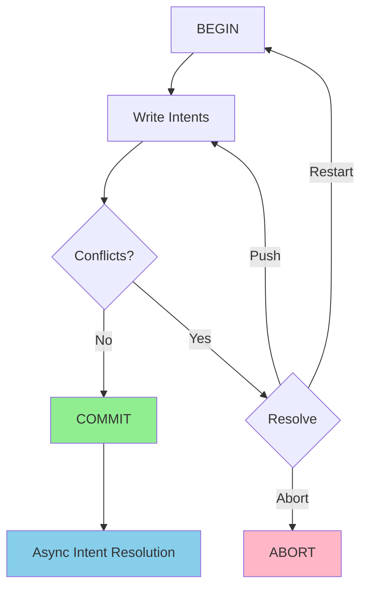

CockroachDB provides **lock-free distributed transactions** with full ACID guarantees through an innovative design based on multi-version concurrency control (MVCC) and optimistic concurrency.

## Design Philosophy

<Note>
Unlike traditional databases that use two-phase locking (2PL), CockroachDB transactions never acquire locks. Instead, they use write intents and timestamp-based conflict resolution.
</Note>

From `docs/design.md`:

> Cockroach provides distributed transactions without locks. Both SI and SSI require that the outcome of reads must be preserved, i.e. a write of a key at a lower timestamp than a previous read must not succeed.

### Key Advantages

<CardGroup cols={2}>
  <Card title="No Deadlocks" icon="unlock">
    Without locks, deadlock detection and resolution are unnecessary.
  </Card>
  
  <Card title="Lock-Free Reads" icon="book-open">
    Reads never block writes and vice versa, improving concurrency.
  </Card>
  
  <Card title="Fast Failure" icon="bolt">
    Conflicts detected early - writes fail fast rather than blocking.
  </Card>
  
  <Card title="No Starvation" icon="scale-balanced">
    Priority system ensures long transactions eventually complete.
  </Card>
</CardGroup>

## Isolation Levels

CockroachDB supports two isolation levels:

### Snapshot Isolation (SI)

<Accordion title="Characteristics">
- Reads see consistent snapshot at transaction start time
- Writes validated at commit time
- Allows **write skew** anomalies in rare cases
- Higher performance under contention
- Can have timestamp pushed forward without restart
</Accordion>

### Serializable Snapshot Isolation (SSI) 

<Accordion title="Characteristics">
- Default isolation level
- Eliminates all anomalies including write skew
- Transactions restart if timestamp pushed
- Provides **serializability** guarantee
- Minimal overhead in low-contention scenarios
</Accordion>

From the design document:

> SSI is the default level, with SI provided for application developers who are certain enough of their need for performance and the absence of write skew conditions to consciously elect to use it.

<Warning>
Write skew can occur in SI when two concurrent transactions read overlapping data and write to disjoint sets, potentially violating application invariants.

**Example**: Two transactions each read account balances, verify sufficient total funds, then withdraw from different accounts. SI allows both to commit even if total becomes negative.
</Warning>

## Hybrid Logical Clock (HLC)

<Note>
CockroachDB uses Hybrid Logical Clocks to assign timestamps that combine physical wall clock time with logical counters for causality tracking.
</Note>

### HLC Structure

```go
// From pkg/util/hlc/hlc.go (simplified)
type Timestamp struct {
    WallTime int64  // Physical time (nanoseconds since epoch)
    Logical  int32  // Logical counter for same wall time
}
```

### HLC Properties

From the design document:

> HLC time uses timestamps which are composed of a physical component (thought of as and always close to local wall time) and a logical component (used to distinguish between events with the same physical component).

**Key behaviors**:
- Reading: Update local HLC with max(local, received timestamp)
- Writing: Use current HLC timestamp
- Guarantee: HLC time ≥ wall time always

### Clock Synchronization

<Tip>
CockroachDB requires loose clock synchronization (default max offset: 500ms). NTP is recommended but not as strict as Spanner's atomic clocks.
</Tip>

**Uncertainty Interval**:

When reading from remote nodes:
- Read at timestamp `t`
- Uncertainty window: `[t, t + max_clock_offset]`
- Values in uncertainty window trigger restart
- Optimization: mark node as "certain" after first restart

## Transaction Execution

### Transaction Lifecycle



### Two-Phase Execution

From `docs/design.md`:

<Steps>
  <Step title="Phase 1: Write Intents">
    
    **Start transaction**:
    - Select range likely to be heavily involved
    - Write transaction record with state "PENDING"
    - Assign random priority and candidate timestamp
    
    **Write data**:
    - Write "intent" values (normal MVCC values with intent flag)
    - Include transaction ID with each intent
    - Intents written in parallel to all affected ranges
    - Record maximum timestamp from all writes
    
    ```go
    // Simplified intent structure
    type Intent struct {
        Key      roachpb.Key
        Txn      TxnMeta      // Transaction ID, timestamp, priority
        Value    roachpb.Value
    }
    ```
  </Step>
  
  <Step title="Phase 2: Commit">
    
    **Commit transaction**:
    - Update transaction record to "COMMITTED"
    - Use final timestamp (max from phase 1)
    - For SSI: verify timestamp not pushed, else restart
    - For SI: accept pushed timestamp
    - **Transaction considered committed** at this point
    
    **Resolve intents (async)**:
    - Remove "intent" flag from all written values
    - Can happen asynchronously after commit
    - Gateway tracks intents for resolution
    - Other transactions may resolve abandoned intents
  </Step>
</Steps>

<Tip>
Control returns to client as soon as transaction record is committed, before intent resolution completes. This reduces latency significantly.
</Tip>

## Transaction Records

From `docs/design.md`:

> Please see `pkg/roachpb/data.proto` for the up-to-date structures, the best entry point being `message Transaction`.

**Transaction Record contains**:
- Transaction ID (UUID)
- Transaction status (PENDING, COMMITTED, ABORTED)
- Candidate timestamp
- Priority
- Isolation level
- Written keys (for intent resolution)

**Transaction Record location**:
- Stored in range containing first written key
- Accessible via transaction ID
- Updated via Raft consensus

## Conflict Resolution

<Note>
Conflicts are resolved using timestamp manipulation and transaction priorities rather than blocking or locks.
</Note>

### Transaction Interactions

#### Reader Encounters Write Intent (Newer)

```
Timeline: Reader@100 finds Intent@150

Action: No conflict
Reason: Reading older version is safe
Result: Reader proceeds with its timestamp
```

#### Reader Encounters Write Intent (Older)

```
Timeline: Reader@200 finds Intent@100

Steps:
1. Follow txn ID to transaction record
2. If committed: read the value
3. If pending:
   a. SI txn: Push commit timestamp to 200+
   b. SSI txn: Compare priorities
      - Higher priority: Push other txn timestamp
      - Lower priority: Restart with higher priority
```

From the design document:

> If the reader has the higher priority, it pushes the transaction's commit timestamp (that transaction will then notice its timestamp has been pushed, and restart). If it has the lower or same priority, it retries itself using as a new priority `max(new random priority, conflicting txn's priority - 1)`.

#### Writer Encounters Uncommitted Intent

```
Timeline: Writer finds Intent from other transaction

Steps:
1. Check other transaction's priority
2. Lower priority: Abort conflicting transaction
3. Higher/equal priority:
   - Retry with priority = max(random, other - 1)
   - Randomized backoff before retry
```

#### Writer Encounters Newer Committed Value

```
Timeline: Writer@100 finds Value@150

Action: Transaction restart
New timestamp: 150
Priority: Unchanged
```

#### Writer Encounters Read Timestamp

<Accordion title="Read Timestamp Cache">
Each range maintains an in-memory cache:

```go
// Conceptual structure
type TimestampCache struct {
    // Maps key ranges to latest read timestamp
    entries map[KeyRange]hlc.Timestamp
    lowWaterMark hlc.Timestamp
}
```

**On write**:
- Check if key was read after write's timestamp
- If yes: return new timestamp, forcing restart (SSI only)
- Cache bounded, evicts oldest entries
</Accordion>

From `docs/design.md`:

> If the write's candidate timestamp is earlier than the low water mark on the cache itself (i.e. its last evicted timestamp) or if the key being written has a read timestamp later than the write's candidate timestamp, this later timestamp value is returned with the write.

### Transaction Restart vs. Abort

**Restart**:
- Reuse same transaction ID
- Update priority and/or timestamp
- Implicit cleanup of old intents during re-execution
- More efficient than abort

**Abort**:
- Transaction explicitly aborted
- New transaction ID required for retry
- Intents cleaned up asynchronously
- Used when transaction record marked ABORTED

## Transaction Priorities

<Note>
Priorities prevent starvation and allow application-level control over conflict resolution.
</Note>

### Priority Assignment

**Initial**: Random value

**On conflict**: 
```go
newPriority = max(randomPriority(), conflictingPriority - 1)
```

**Application override**:
```sql
SET TRANSACTION PRIORITY HIGH;
```

<Tip>
**Use case**: Make OLTP transactions 10x less likely to abort than background analytics jobs by assigning higher priorities.
</Tip>

### Deadlock Freedom

From the design document:

> Priorities avoid starvation for arbitrarily long transactions and always pick a winner from between contending transactions (no mutual aborts).

**How it works**:
- Each conflict has a winner (higher priority)
- Loser increases priority on retry
- Eventually, retrying transaction has highest priority
- Guaranteed progress

## Transaction Coordinator

### Gateway Role

From `docs/design.md`:

> Transactions are managed by the client proxy (or gateway in SQL Azure parlance). Unlike in Spanner, writes are not buffered but are sent directly to all implicated ranges.

**Responsibilities**:
- Track transaction state
- Send writes to appropriate ranges
- Heartbeat transaction record
- Resolve intents on commit/abort
- Handle transaction restarts

Implementation: `pkg/kv/kvclient/kvcoord/txn_coord_sender.go`

### Transaction Heartbeats

<Warning>
Transactions must periodically heartbeat their transaction record to prove they're still alive. Default interval: 5 seconds.
</Warning>

**Purpose**:
- Detect abandoned transactions
- Allow cleanup of orphaned intents
- Prevent blocking on dead transactions

**If heartbeat stops**:
- Other transactions can abort the abandoned transaction
- Intents cleaned up on encounter
- Range remains available

From the design document:

> Transactions encountered by readers or writers with dangling intents which haven't been heartbeat within the required interval are aborted.

## Write Intents

### Intent Structure

Intents are MVCC values with metadata:

```
Physical Storage:

Key: /users/1/name
MVCC Timestamp: 100
Value: {
  Data: "Alice"
  Metadata: {
    IntentFlag: true
    TxnID: "550e8400-e29b-41d4-a716-446655440000"
    TxnTimestamp: 100
    TxnPriority: 0.8
  }
}
```

### Intent Resolution

After commit:

```go
// Simplified intent resolution
for each intent in transaction {
    if txn.Status == COMMITTED {
        // Remove intent metadata, keep value
        resolveIntent(intent.Key, COMMITTED)
    } else {
        // Remove intent entirely
        resolveIntent(intent.Key, ABORTED)
    }
}
```

<Accordion title="Opportunistic Resolution">
Intents resolved in multiple ways:

1. **Async resolution**: Gateway resolves after commit
2. **On encounter**: Other transactions resolve when found
3. **GC process**: Periodic cleanup of abandoned intents
4. **Intent resolution queue**: Background processing
</Accordion>

## Distributed Transactions

### Single-Range Transactions

```
1. Write intent to range
2. Write transaction record to same range
3. Commit transaction record via Raft
4. Resolve intent

All operations in one Raft group - simple and fast
```

### Multi-Range Transactions

```
Transaction touches ranges A, B, C:

1. Write intents to A, B, C in parallel
2. Write txn record to range A
3. Commit txn record in A via Raft
4. Resolve intents in A, B, C (async)

Intents in B and C reference txn record in A
```

<Note>
Commit is atomic: once transaction record committed in one range, entire transaction is committed even if intent resolution incomplete.
</Note>

## Serializable vs. Strict Serializable

From `docs/design.md`:

### Serializability (Default)

CockroachDB guarantees serializability:
- Transactions appear to execute in some serial order
- No anomalies (dirty read, write skew, etc.)
- Does **not** guarantee real-time ordering

### Strict Serializability (Linearizability)

<Accordion title="Causality Tokens">
Optional feature for strict serializability:

```go
// Transaction 1
txn1.Commit()
token := txn1.GetCommitToken()

// Transaction 2 (causally after txn1)
txn2.SetCausalityToken(token)
txn2.Commit()
// Guaranteed: txn2.timestamp > txn1.timestamp
```

Ensures causally-related transactions get increasing timestamps.
</Accordion>

<Accordion title="Commit Wait (Future)">
Spanner-style commit wait:

```
1. Commit transaction at timestamp T
2. Wait for: now() > T + max_clock_offset
3. Return to client

Guarantees: All future reads see committed data
Cost: Added latency equal to max clock offset
```
</Accordion>

## Performance Characteristics

### Advantages

<CardGroup cols={2}>
  <Card title="Low Latency" icon="gauge-high">
    Single-round commit for non-contentious transactions
  </Card>
  
  <Card title="High Concurrency" icon="arrows-split-up-and-left">
    Reads never block writes, writes fail fast
  </Card>
  
  <Card title="No Deadlocks" icon="unlock">
    Priorities ensure progress without deadlock detection
  </Card>
  
  <Card title="Scalable" icon="arrow-trend-up">
    No global lock manager, fully distributed
  </Card>
</CardGroup>

### Trade-offs

<Warning>
**Abort Rate**: High contention causes more transaction restarts than 2PL.

**Uncertainty Restarts**: Clock uncertainty can cause restarts on cross-datacenter reads.

**Intent Cleanup**: Abandoned transactions leave intents that slow subsequent operations.
</Warning>

## Example: Bank Transfer

```sql
BEGIN;
  -- Read balances (establishes read timestamps)
  SELECT balance FROM accounts WHERE id = 1; -- Returns 100
  SELECT balance FROM accounts WHERE id = 2; -- Returns 50
  
  -- Write intents
  UPDATE accounts SET balance = balance - 30 WHERE id = 1;
  UPDATE accounts SET balance = balance + 30 WHERE id = 2;
  
  -- Commit (atomically updates txn record)
COMMIT;
-- Intent resolution happens asynchronously
```

**Under the hood**:

```
T=100: BEGIN (assign timestamp, priority, txn ID)
T=101: Read account 1 (update timestamp cache)
T=102: Read account 2 (update timestamp cache)  
T=103: Write intent for account 1 @ timestamp 100
T=104: Write intent for account 2 @ timestamp 100
T=105: Commit txn record (makes transaction durable)
T=106+: Async intent resolution
```

## Implementation Details

Key source files:

**Transaction Coordination**:
- `pkg/kv/kvclient/kvcoord/txn_coord_sender.go`
- `pkg/kv/txn.go`

**Intent Resolution**:
- `pkg/kv/kvserver/replica_proposal.go`
- `pkg/kv/kvserver/intent_resolver.go`

**Timestamp Cache**:
- `pkg/kv/kvserver/tscache/`

**Concurrency Control**:
- `pkg/kv/kvserver/concurrency/`

## Further Reading

<CardGroup cols={3}>
  <Card title="Storage Layer" icon="hard-drive" href="/architecture/storage-layer">
    MVCC implementation
  </Card>
  
  <Card title="Replication Layer" icon="copy" href="/architecture/replication-layer">
    Raft and consensus
  </Card>
  
  <Card title="SQL Layer" icon="database" href="/architecture/sql-layer">
    Transaction SQL interface
  </Card>
</CardGroup>